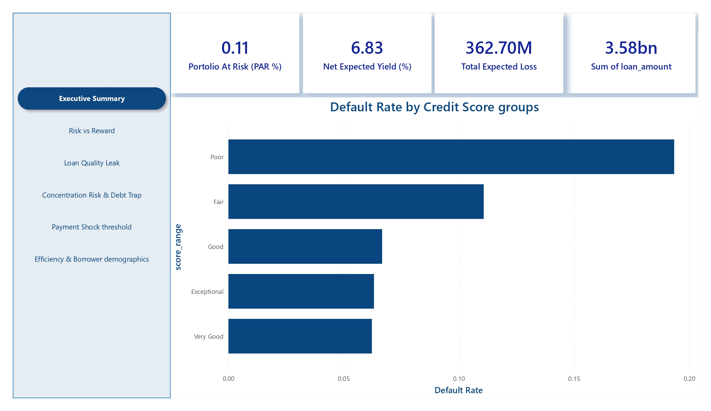

# Portfolio Intelligence Briefing
**Prepared for:** Chief Executive Officer
**Presented by:** Sharon
**Portfolio Period:** March 2024 – February 2026
**Classification:** Executive Confidential

---

## Dashboard Preview

---

## Portfolio Vital Signs

| Metric | Value | Signal |
|---|---|---|
| Total Portfolio Value | $3.58B | — |
| Portfolio at Risk (PAR %) | 0.11% |  Healthy |
| Net Expected Yield | 6.83% |  Monitor |
| Total Expected Loss | $362.70M |  Requires Action |

---

## Finding 1 — Risk vs. Reward: Poor Credit Is Profitable, But Barely

**The question:** Are we making money on our Poor and Fair credit segments after accounting for their default rates?

**The answer:** Yes — but the margin is dangerously thin.

- The **Poor** credit segment charges an average interest rate of ~25%, but after default losses, the net expected yield collapses to approximately **5%**
- The **Fair** segment charges ~19% and nets approximately **8%**
- By contrast, **Very Good** borrowers charge ~11% but net ~5% — almost the same as Poor credit, with a fraction of the risk
- **Exceptional** credit borrowers net the lowest yield (~2%), confirming we are not adequately pricing the opportunity cost of capital deployed to prime borrowers

**Strategic implication:** The Poor and Fair segments are not "empty volume" — they are contributing yield. However, a 200–300 basis point deterioration in the default rate for these segments would make them net-negative. They are operating without a safety buffer.

**Recommended action:** Raise the floor interest rate for Poor credit borrowers by 150–200bps. Introduce a minimum net yield threshold of 8% as an approval gate for sub-620 credit score applications.

---

## Finding 2 — Loan Quality Leak: Underwriting Standards Are Holding, But Volatility Is Rising

**The question:** Is the default rate of our newer loans higher than loans issued a year ago at the same point in their lifecycle?

**The answer:** Not structurally higher — but increasingly volatile and harder to predict.

- The monthly default rate has oscillated between **10% and 12%** across the full 24-month window
- The sharpest default rate spike occurred in **August–September 2024**, reaching approximately **11.8%**, before recovering
- Volume and default rate do not move in correlation — months with the highest origination volumes do not consistently produce the highest default rates, suggesting underwriting discipline is being maintained during growth periods
- However, the default rate in **early 2026** is showing an uptick that warrants monitoring

**Strategic implication:** There is no confirmed vintage quality leak at this time. However, the absence of a clear downward trend in default rates as the portfolio matures is a yellow flag — a healthy, well-underwritten book should show improving cohort performance over time.

**Recommended action:** Implement a formal vintage tracking dashboard. Flag any cohort whose 6-month default rate exceeds the prior year's same-month cohort by more than 1 percentage point.

---

## Finding 3 — Concentration Risk: Debt Consolidation Is Both Our Largest Bet and Our Largest Threat

**The question:** If the economy dips, which loan purpose will sink us?

**The answer:** Debt Consolidation — by a significant margin.

- **Debt Consolidation** represents the largest segment by loan volume at approximately **$1.4B**, nearly double the next largest category
- Its default rate sits above **10.2%**, making it simultaneously our most concentrated and one of our higher-risk segments
- **Medical** loans carry a comparable default rate (~10.1%) but represent a fraction of the volume, limiting their systemic impact
- **Home Improvement** and **Education** loans show lower default rates and moderate volume — these are our most balanced risk-to-volume segments
- **Venture** loans carry the highest default rate of all categories but represent minimal volume

**Strategic implication:** In a recessionary scenario, borrowers who took Debt Consolidation loans are precisely the borrowers whose financial stress compounds first — they were already over-leveraged when they came to us. A 2% deterioration in this segment's default rate would add approximately **$28M** to expected losses.

**Recommended action:** Impose a hard portfolio concentration cap — no single loan purpose should exceed 40% of total book value. Begin gradually diversifying origination mix toward Home Improvement and Education segments which show better risk-adjusted performance.

---

## Finding 4 — Payment Shock Threshold: The Default Cliff Is at DTI 0.45

**The question:** At what Debt-to-Income ratio do defaults spike? Where is our hard cap?

**The answer:** The cliff is clearly visible between DTI 0.40 and 0.50.

- From DTI 0.10 through 0.40, the default rate rises gradually from approximately **5.8% to 6.8%** — a manageable, predictable risk curve
- Between DTI **0.40 and 0.50**, the default rate makes a non-linear jump to approximately **10.5%**
- Above DTI **0.50**, default rates reach **11.5–12%** — nearly double the rate seen at DTI 0.30
- This inflection point is consistent across the data — it is not noise, it is a structural threshold

**Strategic implication:** We currently have borrowers above DTI 0.45 in our portfolio. Every loan approved above this threshold carries nearly twice the default probability of a loan at DTI 0.35. This is where our automated approval engine needs a hard gate.

**Recommended action:** Set DTI 0.45 as the maximum threshold for automated loan approvals. Any application above this threshold should require manual underwriter review and must demonstrate compensating factors (higher income stability, lower loan-to-value, strong employment tenure) to proceed.

---

## Finding 5 — The Golden Goose: Age 31–40 With 1–3 Years Employment

**The question:** Which borrower segment combines the highest loan amounts with the lowest default rates?

**The answer:** The 31–40 age group with 1–3 years of employment history is the highest-yielding demographic segment.

- Borrowers aged **31–40 with 1–3 years employment** produce a net expected yield of **7.26%** — the highest of any age-employment combination in the portfolio
- The **10+ years employment** group across all age bands also performs strongly, averaging **6.93%** net yield
- The **under 1 year employment** group is the weakest performer at **6.06%** net yield, and this weakness is consistent across all age groups
- Older borrowers (61–75 years) with short employment tenure are the single weakest segment at **4.43%** net yield
- The **31–40 age group** is consistently the strongest performing age cohort regardless of employment length

**Strategic implication:** Our Golden Goose is the mid-career professional — established enough to have a stable employment track record, young enough to have a long repayment horizon ahead of them. The under-1-year employment group across all ages represents a segment where risk-adjusted returns do not justify current pricing.

**Recommended action:** Concentrate next quarter's marketing spend on the 28–42 age demographic with 2+ years of employment history. This segment produces the best yield, the most predictable repayment behavior, and the highest average loan amounts. Introduce a minimum 12-month employment requirement as a soft gate for new originations.

---

## Summary Decision Matrix

| Finding | Risk Level | Immediate Action Required |
|---|---|---|
| Poor/Fair credit margin compression |  Medium | Raise floor rates by 150–200bps |
| Vintage quality volatility |  Medium | Implement cohort tracking dashboard |
| Debt Consolidation concentration |  High | Cap at 40% of book; diversify mix |
| DTI cliff at 0.45 |  High | Hard cap at 0.45 in approval engine |
| Golden Goose segment identified |  Opportunity | Redirect Q2 marketing to 31–40 age group |

---

*This document is prepared from synthetic portfolio data for analytical purposes. All figures are derived from the 250,000-loan dataset generated for this engagement.*